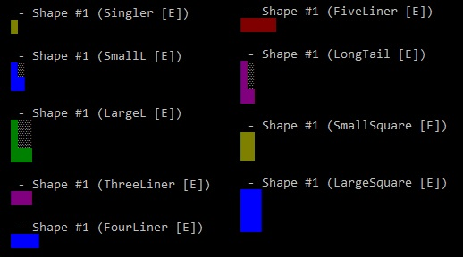

# The Puzzle Block <i>*Coding*</i> Challenge


Welcome to the Puzzle Block Challenge. This challenge is based on the [Block Puzzle Jewel](https://play.google.com/store/apps/details?id=com.differencetenderwhite.skirt) game from [hua weiwei](https://www.google.co.il/search?q=hua+weiwei&stick=H4sIAAAAAAAAAOPgE-LVT9c3NEw2My9PyzXNUIJxc5KqsswKtVSyk630k8vS9ZPzcwtKS1KL4ssyU1Lz0xNzU60KSpNyMoszUosAP-KR8UYAAAA&sa=X&ved=0ahUKEwjlnJqlxOvXAhWSZlAKHVSUCkoQmxMIoAEoATAU) available on Android. From the author:

> The goal is to drop blocks in order to create and destroy full lines on the screen both vertically and horizontally. Don't forget to keep the blocks from filling the screen in this addictive puzzle game.

_This_ challenge provides a working implementation of the game, build in C# running on Windows. The implementation comes with a few different implementations of the player, each performing differently. The player implementation is modeled in classes that derive from the `IPlayer` interface. The purpose of this challenge is to code a _new implementation_ of the `IPlayer` interface, which will beat all other  implementations by gaining the highest score. 

## The Rules

* You may alter the implementation of the game only for the purpose of supporting your `IPlayer` implementation
    * Do NOT, for example, alter the definition of `Shape` or the way the score is calculated
* Fork the main branch and push your implementation there. The implementation will be compared to master to make sure no cheats were introduced
* You may use one of the built-in implementation of `IPlayer`, including `SingleStepGreedyPlayer`, `MultiFactorSingleStepPlayer` or `FullEvalPlayerBase`. 
* You may alter one of these implementations completely. 

## The Challenge

In the challenge, the main measure is the final score. Each implementation will be executed 3 times. Only the highest score will be considered. 
The winner is the implementation that reaches the highest score. If two competing implementations get to the same final score, the one that ran for the shortest time wins. 
Each run will be executed using a predetermined seed, so that all implementation will be executed 3 times with 3 different seeds. 

## The Solution Structure

The solution consists of the following projects:

| Project | Description
| --- | --- |
|`PuzzleBlockConsole`|A single project that holds the core implementation of the game, as well as the various `IPlayer` implementations. 
|`Tests`|A Tests project which includes tests for various components in the game|

In `PuzzleBlockConsole` you'll find the following files and folders

|File/Folder|Description
| --- | --- |
|`Game.cs`|This is where the `Main()` flow of the game is executed. The ctor of `Game` takes an `IPlayer` implementation, so instantiating your `IPlayer` implementation and passing it on to the ctor happens here. In addition, this is where the seed for the `Random rnd` object is set, in favor of running the same game multiple times. The `Game` object holds a `Board` object, as well as a list of `Shape` objects. The main flow is in `Play()` which basically loops as long as `!board.GameOver()`.|
|`Board.cs`|The `Board` object is where most of the logic of the Block Puzzle game is implemented. The `Board` object holds the `bool[][] Cells` which indicates if a cell is free or occupied, as well as a `int Score` member. As you build your `IPlayer` implementation, you will be using the various `Board` members and methods to evaluate the possible placements. The `Board` object has a copy constructor `public Board(Board source)` which can be used to evaluate different placement without effecting the real `Board`.|
|`Shapes.cs`|This class holds the definition of the various supported shapes. You typically do not need to work directly with the various shapes, because you can simply use the `Board.TryPlace()` method which receives a `Shape` object. However, you can access the `Type ShapeType`, `ShapeOrientation Orientation` and `bool[,] Bits` to better decide on placements.|
|`.\Utils\`|This folder holds various helpful utilities such as `MaxArea` which calculates the largest available area on the board, and `Fragmentation` which calculates a fragmentation score. Feel free to alter these implementations and add new ones.|
|`.\Players\`|This is where you should place your own `IPlayer` implementation, and can view other existing implementations.|

## The IPlayer Interface

```csharp
interface IPlayer
{
    void MakeAMove(
      out int shapeId, 
      out string placement, 
      Board board, 
      IDictionary<int, Shape> shapes, 
      IGameDrawer renderer);
}
```

The only method that needs to be implemented is `MakeAMove()`. This method is called by the game continuously, as long as it is still possible to place a `Shape` on the game board. 
The implementation receives a `board` object, as well as an `IDictionary<int, Shape> shapes`, and needs to output the chosen `shapeId` to place and a `placement` string descriptor that specifies where to place the `shape` on the board. 

The method receives the following parameters:

* `out int shapeId`: The implementation must output a value between 1 and 3 to the caller, which will indicate which shape needs to be placed in this turn. Use the `key` from the `shapes` dictionary to determine the `shapeId`
* `out string placement`: The implementation must output a 2 char string indicating the location to place the shape. The first char should be alphanumeric 'a'-'h' and the second char should be numeric '1'-'8'. For example, return `b4` to place the shape starting from the upper-left corner in b4.
* `Board board`: The `board` object includes all the information about the current state of the `board`, as well as different methods to test and manipulate the board. 
* `IDictionary<int, Shape> shapes`: A dictionary of the currently available shapes, that needs to be placed in this turn. The dictionary maps between the `int shapeId` and the actual `shape` object.
* `IGameDrawer renderer`: Can be used to render output to the Console using the `ConsoleGameDrawer` implementation

## How to implement the Player

### From Scratch

You can start from scratch and simply create a new `class` that implements `IPlayer`. As described above, you will simply need to implement the `MakeAMove()` method, which will be called by the game continuously until it is no longer possible to place any of the remaining shapes on the board. 

It is recommended that you place your implementation in the Players folder.

For reference, see the implementation of `ManualPlayer` that reads input from the user via the `Console`. 

### Single Step Greedy

Alternatively, you can inherit from the `abstract` `SingleStepGreedyPlayer` class. 

In this implementation, the `MakeAMove()` method iterates over all possible shapes in any specific turn, and attempts to place it in any possible location on the board. For each possible placement, the implementation calls the `Gain()` abstract method, which you need to implement with your own logic of calculating the <i>gain</i> of that specific placement. Then that gain is compared to the last know <i>best</i> gain, using the implementation of `Eval()`. In `Eval()` you can specify how to evaluate the current gain with the last know best gain. If the new gain is "better", it will become the last know best gain. 

```csharp
public void MakeAMove(out int shapeId, out string placement, Board board, 
    IDictionary<int, Shape> shapes, IGameDrawer renderer)
{
    placement = "";
    shapeId = 0;
    var valGain = InitVal();
    foreach (var shape in shapes)
    {
        for (int x = 0; x < 8; x++)
            for (int y = 0; y < 8; y++)
            {
                var newBoard = new Board(board);
                var curPlacement = "" + (char)(97 + x) + (char)(49 + y);
                if (newBoard.TryPlace(shape.Value, curPlacement))
                {
                    var curValGain = Gain(newBoard, board);
                    if (Eval(curValGain, valGain))
                    {
                        valGain = curValGain;
                        placement = curPlacement;
                        shapeId = shape.Key;
                    }
                }
            }
    }
}
```

As an example, see below the implementation of `Gain()` and `Eval()` for a `Player` that tries to maximize the `Score` for each placement:

```csharp
class ScoreSingleStepGreedyPlayer : SingleStepGreedyPlayer
{
    override public bool Eval(int curGain, int gain)
    {
        return (curGain > gain);
    }

    override public int Gain(Board newBoard, Board board)
    {
        return newBoard.Score - board.Score;
    }
}
```

The advantage of this implementation is that it is relatively fast, but the disadvantage is that it only evaluates one step at a time. 

### Full Evaluation

To do a full analysis of all possible placements given all 3 shapes in each turn, you can derive your implementation from `FullEvalPlayerBase`. This implementation recursively goes over all possible placements for all 3 shapes in any order, and gives you a chance to calculate stats for each placement and for each `GamePath`. 

A `GamePath` is essentially a list of up to 3 `Moves` that is calculate by the implementation. 

Deriving from this implementation, you will need to implement the `IFullEvalPlayer` interface

```csharp
interface IFullEvalPlayer
{
    GamePath SelectBestPath(List<GamePath> paths);
    void GatherStepStats(Candidate candidate, GamePath gamePath, Board board, Board newBoard);
    void GatherPathStats(GamePath gamePath, Board board);
}
```

#### SelectBestPath

This method is called after all possible paths have been calculated, to let you select the best path. For example, this implementation uses Linq to sort all paths according to the top score, and returns the first path on the list. 

```csharp
public override GamePath SelectBestPath(List<GamePath> paths)
{
    var scores = from x in paths orderby x.Score descending select x;
    return scores.First();
}
```

#### GatherStepStats

This method is called for each placement that was found (part of the path), and gives you a chance to calculate scores for the step and for the path.

For example, this implementation compares the `newBoard` (the one with the new placement) with the previous `board` to calculate the gain in score made with this placement. It then adds this `ScoreGain` to the overall `ScoreGain` of the `GamePath`. 
```csharp
public override void GatherStepStats(Candidate candidate, GamePath gamePath, Board board, Board newBoard)
{
    var scoreGain = newBoard.Score - board.Score;
    candidate.ScoreGain = scoreGain;
    gamePath.ScoreGain += scoreGain;
}
```

#### GatherPathStats

Finally, this method is called at the end of the `GamePath` evaluation. In this example 
## Testing

To test your implementation, edit the `Main()` method in `Game`, and instantiate your implementation of IPlayer in the `Game` constructor. 

```csharp
static void Main()
{
    var seed = DateTime.Now.Millisecond;

    var game = new Game(new FullEvalPlayer());    // Put here you IPlayer implementation
    game.rnd = new Random(seed);                  // Consider using a constant seed for debugging

    var start = DateTime.Now;
    game.Play();

    Console.WriteLine(@"Duration: {0:mm\:ss\.ff}", (DateTime.Now - start));
    Console.WriteLine("Game seed: " + seed);
    Console.ReadLine();
}
```
