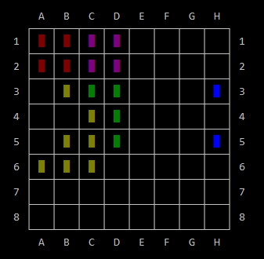

# The Puzzle Block <i>*Coding*</i> Challenge

Welcome to the Puzzle Block Challenge. This challenge is based on the [Block Puzzle Jewel](https://play.google.com/store/apps/details?id=com.differencetenderwhite.skirt) game from [hua weiwei](https://www.google.co.il/search?q=hua+weiwei&stick=H4sIAAAAAAAAAOPgE-LVT9c3NEw2My9PyzXNUIJxc5KqsswKtVSyk630k8vS9ZPzcwtKS1KL4ssyU1Lz0xNzU60KSpNyMoszUosAP-KR8UYAAAA&sa=X&ved=0ahUKEwjlnJqlxOvXAhWSZlAKHVSUCkoQmxMIoAEoATAU) available on Android. From the author:

> The goal is to drop blocks in order to create and destroy full lines on the screen both vertically and horizontally. Don't forget to keep the blocks from filling the screen in this addictive puzzle game.

_This_ challenge provides a working implementation of the game, built in C#. The implementation comes with a few different versions of the player, each performing differently. The player implementation is modeled in classes that derive from the `IPlayer` interface, which are instantiated and passed to the `Game` object. 

__The purpose of this challenge is to code a _new implementation_ of the `IPlayer` interface, which will beat all other  implementations by gaining the highest score__. 

## The Rules

* You may alter the implementation of the game only for the purpose of supporting your `IPlayer` implementation
    * Do NOT, for example, alter the definition of `Shape` or the way the score is calculated
* Fork the main branch and push your implementation there. The implementation will be compared to master to make sure no cheats were introduced
* You can start from one of the built-in implementation of `IPlayer`, including `SingleStepGreedyPlayer`, `MultiFactorSingleStepPlayer` or `FullEvalPlayerBase` and modify it, or
* You can start from your own clean implementation of `IPlayer` directly. For more information, see [How to implement the Player](./READMORE.md#how-to-implement-the-player).  

## The Challenges

We have 3 different challenge categories. Anyone can participate in any or all of the challenges. 

### The Score Challenge

In this challenge, the main measure is the final score. Each implementation will be executed 3 times. Only the highest score will be considered. The winner is the implementation that reaches the highest score. If two competing implementations get to the same final score, the one that ran for the shortest time wins. 

Each run will be executed using a predetermined seed, so that it will be possible to compare results in identical conditions. 

When evaluating the different implementations, the program will be executed 5 times, each time with a different seed. Only the seed that produced the highest score (for each implementation) will be considered. 

### The Speed Challenge

In this challenge, the main measure is runtime duration. We will pick a single `IPlayer` implementation, and the `Game` implementation that will be able to execute in the shortest duration wins. 

### The ML Challenge

This challenge is similar to the Score Challenge, but will require the implementation to use some form of Machine Learning technique in order to beat the highest score.

## What's Next?

To get started, clone PuzzleBlock and start coding. For further reading:

* [The Solution Structure](./READMORE.md#the-solution-structure)
* [The IPlayer Interface](./READMORE.md#the-iplayer-interface)
* [How to implement the Player](./READMORE.md#how-to-implement-the-player)
* [Testing](./READMORE.md#testing)
